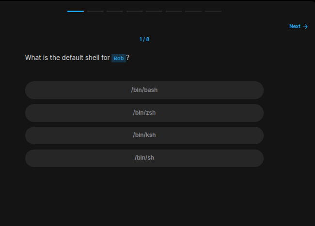
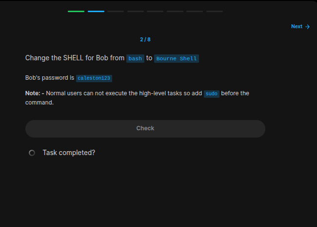
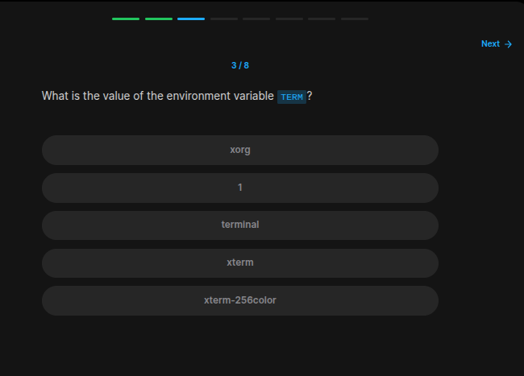
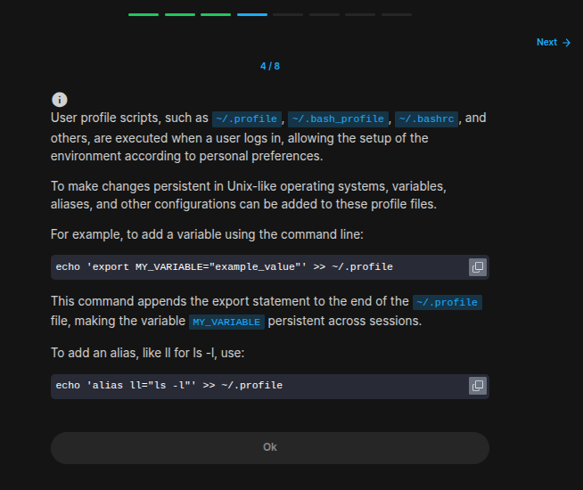
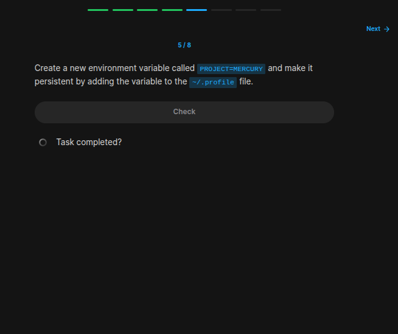
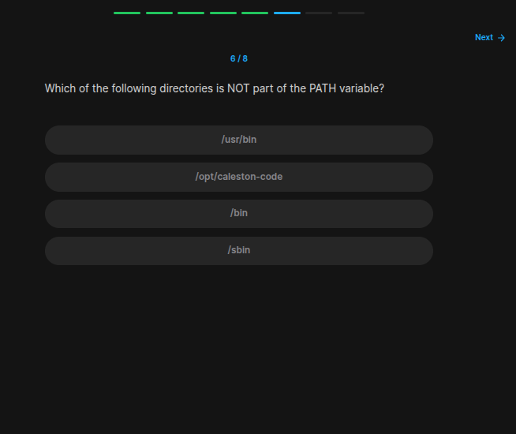
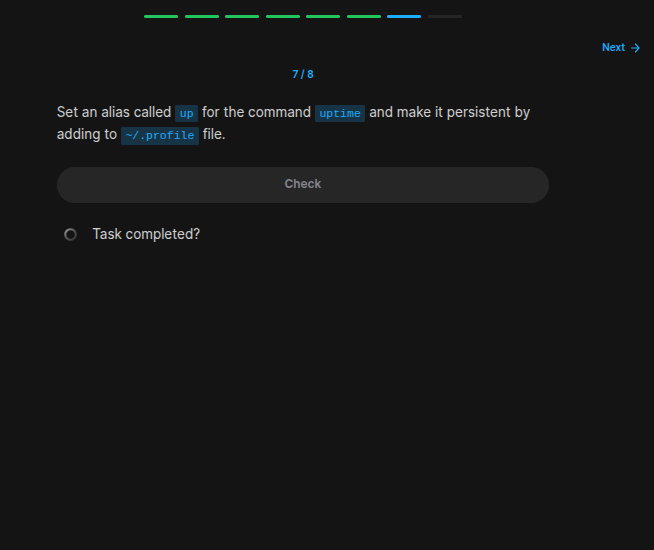
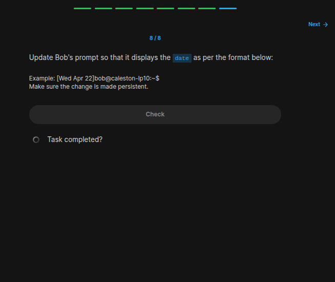

## Table of Contents

- [Introduction](#introduction)
- [Exercise 1/8](#exercise-18)
- [Exercise 2/8](#exercise-28)
- [Exercise 3/8](#exercise-38)
- [Exercise 4/8](#exercise-48)
- [Exercise 5/8](#exercise-58)
- [Exercise 6/8](#exercise-68)
- [Exercise 7/8](#exercise-78)
- [Exercise 8/8](#exercise-88)


##  Introduction

Understanding linux services.
### Exercise 1/8

```bash
# https://askubuntu.com/questions/87853/what-is-default-shell-for-terminal

echo $SHELL
# this is the output: "/bin/bash"
```
### Exercise 2/8

```bash
# From my little research i guess i can use chsh command but here is the thing, i didn't use it before.

# We can use this link as a map:
# https://man7.org/linux/man-pages/man1/chsh.1.html

# For permission problems, we are told that we have to use sudo:
sudo chsh -s /bin/sh bob

# After giving the password, you might get an error saying this:
# PAM: Authentication failure 

# to solve this, you can follow this link:
# https://askubuntu.com/questions/812420/chsh-always-asking-a-password-and-get-pam-authentication-failure

# To check either our command worked, lets write this:
grep "^bob:" /etc/passwd

# EXAMPLE OUTPUT:
# bob:x:1000:1000::/home/bob:/bin/sh

# Note: I couldn't solve this, got some help from hints :').
```
### Exercise 3/8

```bash
# To see environment variables, we have to run this:
printenv
```
### Exercise 4/8

```bash

```
### Exercise 5/8

```bash
# Lets add the variable to the environment variables:
echo 'PROJECT=MERCURY' >> ~/.profile
```
### Exercise 6/8

```bash
# https://www.digitalocean.com/community/tutorials/how-to-view-and-update-the-linux-path-environment-variable
echo $PATH
```
### Exercise 7/8

```bash
# First lets create an shortcut of this command:
echo "up=uptime" >> ~/.profile

# Then restart the profile so that we can check it:
source ~/.profile
```
### Exercise 8/8

```bash
# Found this:
# https://superuser.com/questions/724368/how-to-display-time-in-terminal-instead-of-usernamehostname
PS1='\t:\u@\h:\w$ '

# Lets cocnfigure that a bit and this is what we got:
PS1='[\d]\u@\h:\w$ '

echo "PS1='[\d]\u@\h:\w$'" >> ~/.profile

```